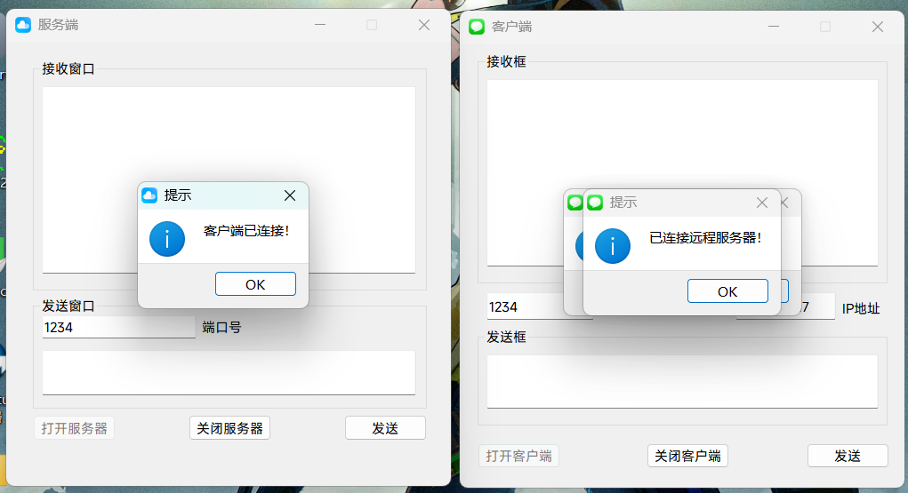
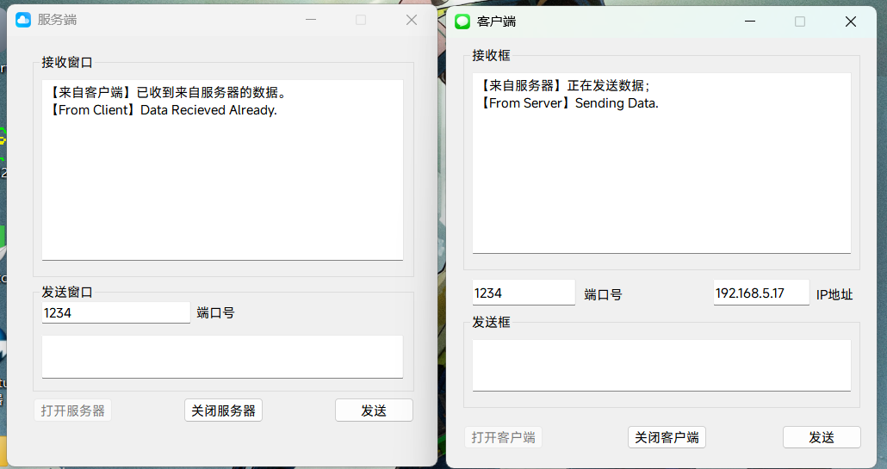
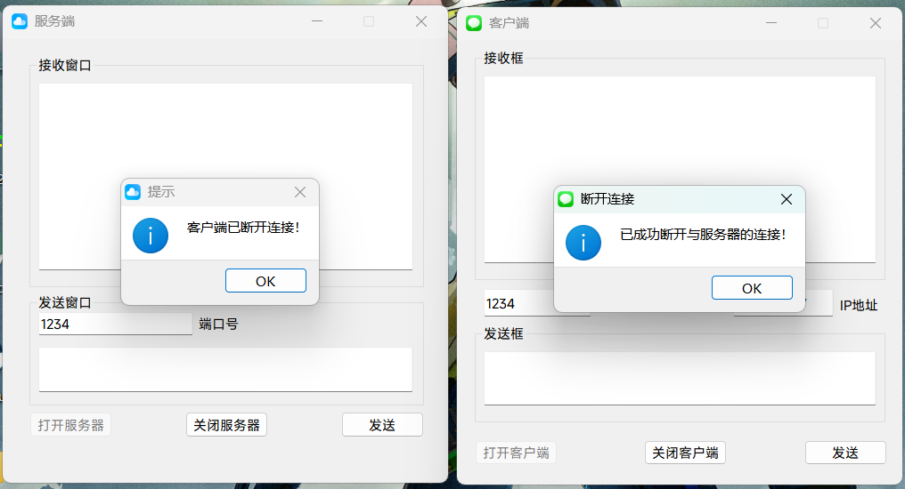

# Qt5.11 C++ TCP服务端项目总结

## 一、程序界面





## 二、 项目简要建设过程
1.  **项目初始化**：创建Qt Widgets Application项目，选择适配编译器（MinGW/GCC），确保Qt5.11环境配置完整，`.pro`文件中添加`QT += network`链接网络模块。
2.  **UI界面搭建**：在Qt Designer中拖拽控件，完成核心布局：端口输入框（PortEdit）、只读接收文本框（RecieveEdit）、发送文本框（SendEdit）、打开/关闭服务器按钮、发送按钮。
3.  **头文件配置**：引入TCP核心头文件，定义`QTcpServer`/`QTcpSocket`成员变量，声明UI点击槽函数和TCP通信自定义槽函数。
4.  **核心逻辑实现**：在`.cpp`文件中实现服务器初始化、端口监听、客户端连接响应、数据收发、断连清理等功能。
5.  **防御性优化**：添加重复点击防护、空值校验、信号绑定清理，避免程序崩溃和异常触发。
6.  **测试调试**：使用Qt自带TCP客户端工具，测试连接、收发数据、异常断连等场景，排查问题并优化。

## 三、 核心代码内容（分点列表形式）
### （一） 头文件（Widget.h）
1.  **核心头文件引入**
    -  代码原型（中文解释）：
      `#include <QTcpServer>`：引入TCP服务器类，负责监听客户端连接请求。
      `#include <QTcpSocket>`：引入TCP套接字类，负责与已连接客户端进行数据传输。
    -  参考代码：
      ```cpp
      #include <QTcpServer>   /* QTcpServer类（负责通信监听） */
      #include <QTcpSocket>   /* QTcpSocket类（负责通信传输） */
      ```
    -  用法：作为前置依赖引入，无需手动调用，确保编译时能识别TCP相关类。
2.  **TCP成员变量定义**
    -  代码原型（中文解释）：
      `QTcpServer *tcpServer;`：TCP服务器指针，用于创建服务器实例、执行监听操作。
      `QTcpSocket *tcpSocket;`：TCP套接字指针，用于与客户端进行数据交互。
    -  参考代码：
      ```cpp
      QTcpServer *tcpServer;
      QTcpSocket *tcpSocket;
      ```
    -  用法：类公有成员变量，可在类内所有函数中访问，初始化时`tcpServer`创建实例，`tcpSocket`设为`nullptr`。
3.  **自定义槽函数声明**
    -  代码原型（中文解释）：
      `void newConnection_Slot();`：处理客户端新连接请求的槽函数。
      `void readyRead_Slot();`：接收客户端发送数据的槽函数。
      `void clientDisconnected_Slot();`：处理客户端断开连接的槽函数。
    -  参考代码：
      ```cpp
      void newConnection_Slot();
      void readyRead_Slot();
      void clientDisconnected_Slot();
      ```
    -  用法：仅做函数声明，需在`.cpp`中实现具体逻辑，通过`connect()`绑定对应信号后自动触发。

### （二） 源文件（Widget.cpp）
1.  **服务器初始化与信号绑定**
    -  代码原型（中文解释）：
      `tcpServer = new QTcpServer(this);`：创建TCP服务器实例，利用Qt父子对象机制管理内存，防止内存泄漏。
      `connect(tcpServer, SIGNAL(newConnection()), this, SLOT(newConnection_Slot()));`：绑定服务器新连接信号与自定义处理槽函数。
    -  参考代码：
      ```cpp
      tcpServer = new QTcpServer(this);
      tcpSocket = nullptr;
      connect(tcpServer, SIGNAL(newConnection()), this, SLOT(newConnection_Slot()));
      ```
    -  用法：在类构造函数中执行，程序启动时自动初始化，无需手动调用。
2.  **打开服务器（端口监听）**
    -  代码原型（中文解释）：
      `tcpServer->listen(QHostAddress::Any, 端口号);`：监听所有主机的指定端口，等待客户端连接。
      `ui->OpenButton->setEnabled(false);`：禁用打开按钮，防止重复点击触发多次监听。
    -  参考代码：
      ```cpp
      tcpServer->listen(QHostAddress::Any, ui->PortEdit->text().toUInt());
      ui->OpenButton->setEnabled(false);
      ```
    -  用法：点击「打开服务器」按钮自动触发，需先校验端口号非空。
3.  **处理客户端新连接**
    -  代码原型（中文解释）：
      `tcpSocket = tcpServer->nextPendingConnection();`：获取待处理的客户端连接，更新套接字指针。
      `disconnect(tcpSocket, nullptr, this, nullptr);`：批量断开套接字旧绑定，避免幽灵触发/重复触发。
      `connect(tcpSocket, SIGNAL(readyRead()), this, SLOT(readyRead_Slot()));`：绑定数据接收信号与处理槽函数。
    -  参考代码：
      ```cpp
      tcpSocket = tcpServer->nextPendingConnection();
      disconnect(tcpSocket, nullptr, this, nullptr);
      connect(tcpSocket, SIGNAL(readyRead()), this, SLOT(readyRead_Slot()));
      ```
    -  用法：客户端连接时自动触发，完成套接字更新和信号绑定，弹出连接成功提示。
4.  **接收客户端数据**
    -  代码原型（中文解释）：
      `tcpSocket->readAll();`：读取客户端发送的所有数据，返回字节数组。
      `ui->RecieveEdit->appendPlainText(数据);`：将接收的数据显示在文本框中。
    -  参考代码：
      ```cpp
      QString buf = tcpSocket->readAll();
      ui->RecieveEdit->appendPlainText(buf);
      ```
    -  用法：客户端发送数据时自动触发，需先校验套接字连接状态。
5.  **发送数据给客户端**
    -  代码原型（中文解释）：
      `tcpSocket->write(数据.toUtf8().data());`：将字符串转为UTF-8格式，发送给客户端。
      `ui->SendEdit->clear();`：发送完成后清空发送文本框。
    -  参考代码：
      ```cpp
      tcpSocket->write(ui->SendEdit->text().toUtf8().data());
      ui->SendEdit->clear();
      ```
    -  用法：点击「发送」按钮触发，需先校验客户端连接状态和发送内容非空。
6.  **关闭服务器/处理客户端断连**
    -  代码原型（中文解释）：
      `tcpServer->close();`：停止服务器监听，不再接收新连接。
      `tcpSocket->abort();`：强制断开客户端连接，释放套接字资源。
      `tcpSocket = nullptr;`：将套接字指针置空，避免野指针。
    -  参考代码：
      ```cpp
      tcpServer->close();
      tcpSocket->abort();
      tcpSocket = nullptr;
      ```
    -  用法：点击「关闭服务器」或客户端断连时触发，清理资源并恢复打开按钮可用状态。

## 四、 项目开发注意事项
1.  **网络模块链接**：必须在`.pro`文件中添加`QT += network`，否则编译器无法识别`QTcpServer`/`QTcpSocket`类，会报未定义错误。
2.  **防止野指针**：`tcpSocket`初始化为`nullptr`，所有操作前都需校验`tcpSocket != nullptr`，避免空指针解引用崩溃。
3.  **信号绑定清理**：处理新连接前，必须批量断开旧/新套接字的绑定，杜绝「幽灵触发」和「重复触发」，这是Qt TCP开发的核心防御手段。
4.  **内存管理**：创建`QTcpServer`实例时指定父对象（`this`），利用Qt父子对象机制自动释放内存，避免手动管理遗漏导致内存泄漏。
5.  **输入校验**：端口号输入框、发送文本框需做非空校验，端口号需转为合法无符号整数（`quint16`），避免非法输入导致程序异常。
6.  **连接状态校验**：收发数据前，需校验`tcpSocket->state() == QTcpSocket::ConnectedState`，避免在未连接/已断连状态下执行读写操作。
7.  **编码格式**：发送字符串时使用`toUtf8()`转为UTF-8格式，保证跨平台、跨设备的数据传输一致性，避免中文乱码。

## 五、 总结
1.  该项目基于Qt5.11实现了TCP服务端的核心功能，包括端口监听、客户端连接、数据收发和断连清理，满足基础的TCP通信需求。
2.  开发核心在于合理使用`QTcpServer`和`QTcpSocket`类，做好信号槽绑定与清理，以及各类防御性校验，保障程序稳定性。
3.  项目中的内存管理、信号绑定清理等技巧，是Qt桌面端网络开发的通用最佳实践，可复用至其他Qt网络项目中。

## 六、责任说明
项目可能存在还未显露的问题，不建议作为主力使用。若该项目的程序造成的设备损坏等问题，作者概不负责。
项目仅限于交流学习，禁止用于商业目的，违者产生的后果，作者概不负责任。照片素材来源于互联网，如有侵犯，请联系项目作者进行删除。
